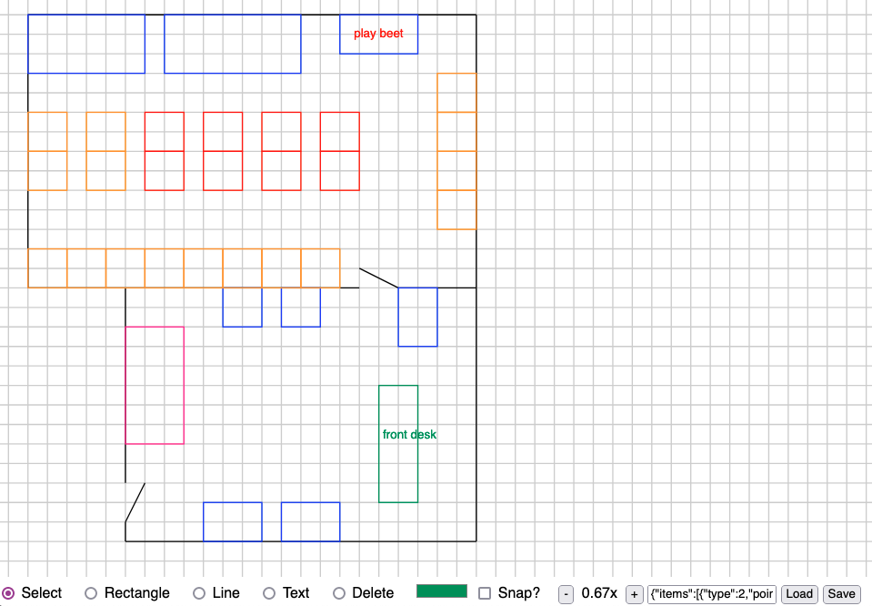

# FloorPlanner

Very quick floor planning tool written for [Arcade UFO](http://arcadeufo.com/) to use.

## Features

* Create rectangles, lines, and text
* Drag and delete existing shapes
* Save and restore designs
* No frameworks, so it should load fast?

## Issues

* Everything is stored in pixel coordinates (should probably be 1 unit per grid line)
* Program organization is starting to get messy

